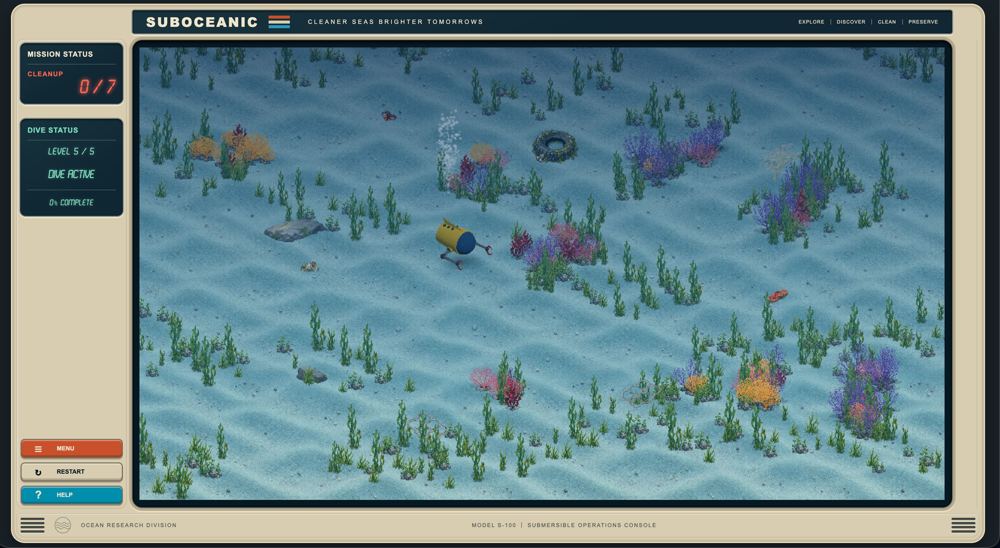
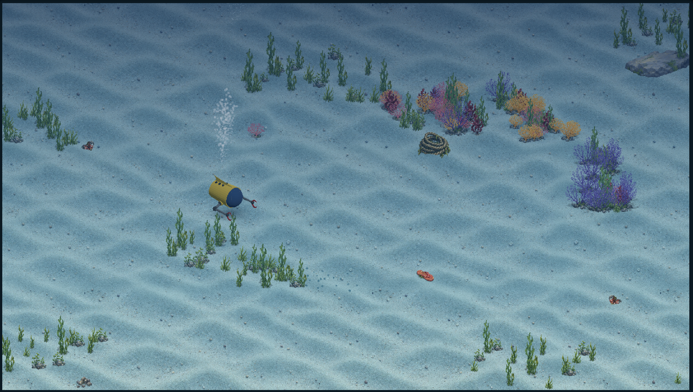
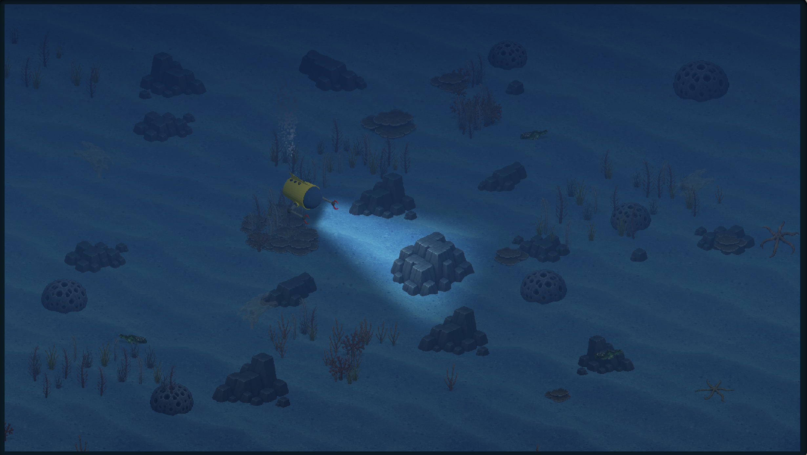
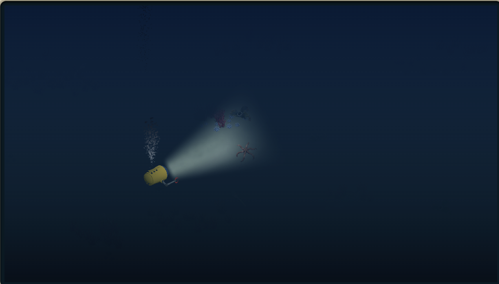

# SUBOCEANIC

A calm underwater exploration and cleanup game built with Phaser, React, and Vite.

Navigate a small submersible through increasingly deep ocean environments, search the seafloor, recover debris, and descend into darker and more isolated waters.

[Play SUBOCEANIC](https://andyfriedl.github.io/SUBOCEANIC/)



## About

SUBOCEANIC is a browser-based underwater exploration game focused on movement, searching, and environmental cleanup rather than combat.

Each biome contains five procedurally generated dives. As the player moves deeper, the environment becomes darker, sparser, and more dependent on the submarine's lights for navigation.

The game is currently in active development.

## Biomes

### Shallow Waters

Bright, active seafloor environments with abundant plants, coral, rocks, and debris.



### Mid Depths

A darker and more open environment with reduced plant life, different seafloor structures, and greater reliance on the submarine's lights.



### Deep Ocean

Sparse, dark terrain designed around searching almost entirely by headlight.



## Features

- Procedurally generated dives
- Five dives per biome
- Depth-specific environment and asset generation
- Dynamic submarine headlights and underwater lighting
- Progressive environmental density as dives increase
- Cleanup-based objectives
- Contextual hint system for difficult-to-find objects
- Animated pickup and bubble effects
- Retro-inspired submarine control interface
- Automatic biome discovery from numbered background assets
- Optional coral, plant, rock, scatter, and fish populations
- No combat or player death

## Controls

| Control | Action |
| --- | --- |
| `W` | Move forward |
| `S` | Reverse |
| `A` | Turn left |
| `D` | Turn right |
| `SPACE` | Grab / collect |

## How Progression Works

Each biome contains five procedural dives.

Environmental density increases from Dive 1 through Dive 5, but each depth has its own overall character:

- **Shallow** — lush to heavily populated
- **Mid** — thinner to moderately populated
- **Deep** — very sparse to somewhat fuller while remaining open and isolated

A biome is enabled by adding a correctly numbered background image such as:

```text
seabed-1.png
seabed-50.png
seabed-100.png